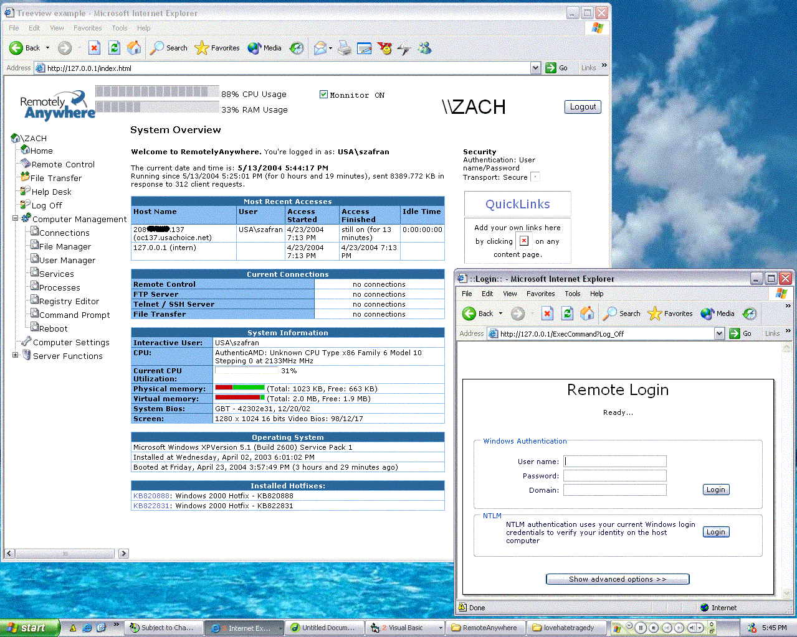



## Remote Administration Through IE\. \(Big Updates\)

### Description

This program is basicly a server that sits on a remote machine. By simply typing the IP address into the internet explorer address bar. it will require you to login with a username ane password. This update containes streaming processes. I also added a connection monitor. Along with other updates the login page is now more secure............................................................................................REMEMBER!!!!!!!! you must change your security options to allow you to use active x components. i have some oages use the activex winsock component...............
 
### More Info
 

             |
---                |---
**Submitted On**   |2004-05-13 17:40:34
**By**             |[Eric Wolcott](https://github.com/Planet-Source-Code/PSCIndex/blob/master/ByAuthor/eric-wolcott.md)
**Level**          |Advanced
**User Rating**    |5.0 (30 globes from 6 users)
**Compatibility**  |VB 3\.0, VB 4\.0 \(16\-bit\), VB 4\.0 \(32\-bit\), VB 5\.0, VB 6\.0, VB Script
**Category**       |[Internet/ HTML](https://github.com/Planet-Source-Code/PSCIndex/blob/master/ByCategory/internet-html__1-34.md)
**World**          |[Visual Basic](https://github.com/Planet-Source-Code/PSCIndex/blob/master/ByWorld/visual-basic.md)
**Archive File**   |[Remote\_Adm1744965132004\.zip](https://github.com/Planet-Source-Code/eric-wolcott-remote-administration-through-ie-big-updates__1-53759/archive/master.zip)

